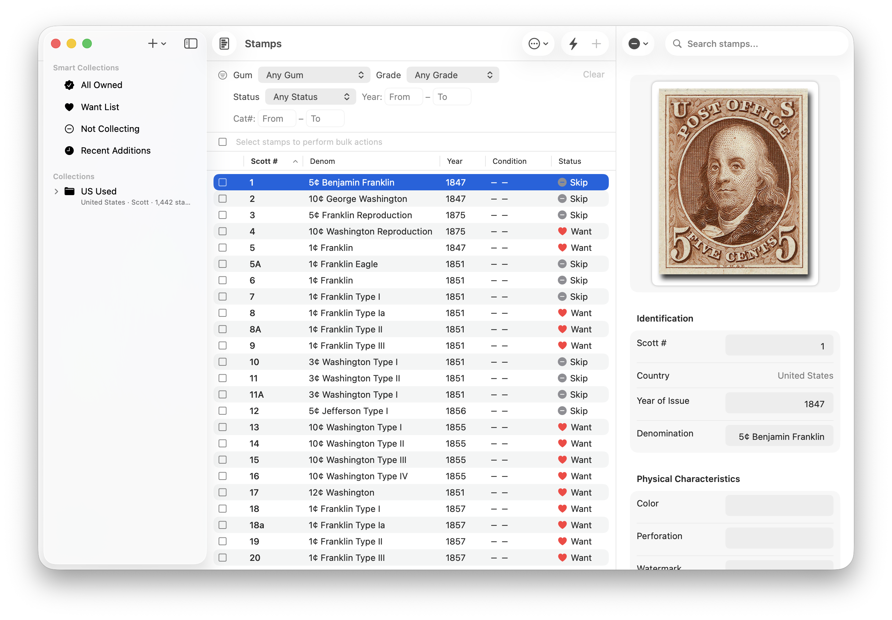

# Hinged

A macOS stamp collection management application built with SwiftUI and SwiftData.

## Download

Download the latest release from the [Releases page](https://github.com/factus10/Hinged/releases).

### Installation

1. Download `Hinged-x.x-macOS.zip` from the latest release
2. Unzip the file
3. Move `Hinged.app` to your Applications folder
4. **First launch**: Right-click (or Control-click) on Hinged.app and select "Open"
   - You'll see a warning that the app is from an unidentified developer
   - Click "Open" to confirm
   - This is only required the first time you run the app

Note: The app is signed but not notarized with Apple. This is why macOS shows a warning on first launch.

## Overview

Hinged helps philatelists organize and track their stamp collections. The app supports multiple collections with different catalog systems, tracks stamp conditions and acquisition details, and provides tools for analyzing collection gaps.



## Requirements

- macOS 14.0 or later
- Xcode 15.0 or later (for building from source)

## Features

### Collection Organization

- **Collections**: Top-level organizational units that define the catalog system (Scott, Michel, Stanley Gibbons, Yvert, Sakura, Facit, or custom catalogs) and country scope
- **Albums**: Subdivisions within collections for organizing stamps by theme, year range, or any preferred grouping
- **Smart Collections**: Automatic filters for viewing stamps across all collections:
  - All Owned
  - Want List
  - Not Collecting
  - Recent Additions (last 30 days)

### Stamp Tracking

- Catalog number with natural sorting (handles prefixes like C, O, B for airmail, officials, etc.)
- Year of issue (single year or range, e.g., "1958" or "1958-1964")
- Denomination
- Color
- Perforation gauge
- Watermark
- Gum condition (MNH, MH, OG, NG, Used, etc.)
- Centering grade (Superb, XF, VF, F-VF, Fine, VG, Good)
- Collection status (Owned, Wanted, Not Collecting)
- Purchase price and date
- Acquisition source
- Notes
- Image attachment

### Country Support

- Country-specific collections with automatic catalog prefixes
- Worldwide collections allowing stamps from any country
- Customizable catalog prefixes per country and catalog system

### Import/Export

- CSV import for bulk stamp entry
- CSV export for backup or external analysis
- Flexible column mapping supporting multiple header formats

### Gap Analysis

- Analyze collection completeness by country and year range
- Identify potential missing catalog numbers
- View completion percentage
- Filter by owned or wanted stamps

### Bulk Actions

- Select multiple stamps using checkboxes in the stamp list
- Select all visible stamps with the header checkbox
- Bulk status change (set all selected to Owned, Wanted, or Not Collecting)
- Bulk delete with confirmation

### Additional Features

- Quick Add Mode for rapid batch entry
- Populate Number Range tool for creating placeholder entries
- Sortable columns with natural catalog number sorting
- Comprehensive filtering by country, condition, grade, status, year range, and catalog number range
- Image storage for stamp scans or photos
- In-app help system (Help menu or Cmd+?)

## Getting Started

### Creating Your First Collection

1. Click the **+** button in the sidebar
2. Select **New Collection...**
3. Enter a name for your collection
4. Choose a catalog system (Scott, Michel, Stanley Gibbons, Yvert, Sakura, or Facit)
5. Select a country, or leave as "Worldwide" for a multi-country collection
6. Click **Create**

### Adding Albums

Albums help you organize stamps within a collection (e.g., by year range, commemoratives vs. definitives).

1. Click the **+** button in the sidebar
2. Select **New Album in...** and choose the parent collection
3. Enter an album name and optional description
4. Click **Add**

Alternatively, right-click a collection and select **Add Album...**

### Adding Stamps

#### Single Stamp Entry

1. Select an album in the sidebar
2. Click the **+** button in the toolbar
3. Fill in the stamp details
4. Select a status (Owned, Wanted, or Not Collecting)
5. Click **Add**

#### Quick Add Mode

For faster batch entry:

1. Enable Quick Add Mode by clicking the lightning bolt icon in the toolbar
2. Click **+** to open the simplified entry form
3. Enter essential details (catalog number, year, condition, status)
4. Click **Add & Next** to save and immediately start the next entry
5. Disable Quick Add Mode when finished

#### Populate Number Range

To create placeholder entries for a range of catalog numbers:

1. Select an album
2. Click the **...** menu in the toolbar
3. Select **Populate Number Range...**
4. Enter an optional prefix (e.g., "C" for airmail)
5. Enter the start and end numbers
6. Select the default status for new entries
7. Click **Create**

#### CSV Import

1. Select the target album
2. Click the **...** menu in the toolbar
3. Select **Import CSV...**
4. Choose your CSV file

Expected CSV format:
```
Catalog Number,Status,Denomination,Year,Color,Gum Condition,Centering Grade,Notes
1,wanted,5c Franklin,1847,brown,mintNeverHinged,veryFine,First US stamp
300-300D,owned,1c-10c Pan-American,1901,various,mintHinged,fine,Complete set
```

The Year column accepts single years (e.g., "1958") or ranges (e.g., "1958-1964").

The Status column accepts:
- `TRUE`, `YES`, `1`, `owned` for owned stamps
- `FALSE`, `NO`, `0`, `wanted` for wanted stamps
- `notCollecting`, `skip` for stamps you're not collecting

### Editing Stamps

Click on any stamp in the list to view and edit its details in the right panel. Changes are saved automatically.

### Settings

Access Settings via the menu bar (Hinged → Settings) or press **Cmd+,** to configure:

#### Defaults Tab
- **Default Catalog System**: Choose the default catalog for new collections (built-in or custom)
- **Default Collection Status**: Set the default status for new stamps (Owned, Wanted, or Not Collecting)
- **Default Gum Condition**: Optionally pre-fill gum condition for new stamps
- **Default Centering Grade**: Optionally pre-fill centering grade for new stamps
- **Currency Symbol**: Set the symbol used when displaying purchase prices

#### Catalogs Tab
- View built-in catalog systems (Scott, Michel, Stanley Gibbons, etc.)
- Create custom catalogs for specialty collecting (revenues, cinderellas, local posts, etc.)
- Custom catalogs can be set as the default for new collections

#### Countries Tab
- Add, edit, and delete countries
- Set catalog prefixes for each country (e.g., "US" for United States in Scott catalog)
- Hinged comes pre-populated with countries worldwide

### Gap Analysis

Click the chart icon in the toolbar to analyze your collection:

1. Select a country
2. Set the year range
3. Click **Analyze Collection**
4. Review the summary showing owned/wanted counts and completion percentage
5. Browse potential gaps in catalog number sequences
6. View wanted stamps grouped by year

## Keyboard Shortcuts

- **Cmd+Shift+N**: Add new collection
- **Cmd+Option+N**: Add new album (when collection selected)
- **Cmd+Shift+E**: Edit selected collection
- **Cmd+Shift+R**: Rename selected album
- **Cmd+Delete**: Delete selected album
- **Cmd+,**: Open Settings
- **Cmd+?**: Open help
- **Cmd+Q**: Quit application

## Data Storage

Hinged stores all data in a user-accessible location:

```
~/Documents/Hinged/
├── Hinged.store      (main database)
└── Images/           (stamp images)
```

This makes it easy to:
- **Back up**: Copy the entire folder, or use File → Export → Export Full Backup
- **Migrate**: Export a backup and import it on another Mac
- **Access images**: Stamp images are stored as individual files in the Images subfolder

## Building from Source

1. Clone the repository
2. Open `Hinged.xcodeproj` in Xcode
3. Build and run (Cmd+R)

## License

This project is licensed under the GNU General Public License v3.0 - see the [LICENSE](LICENSE) file for details.
